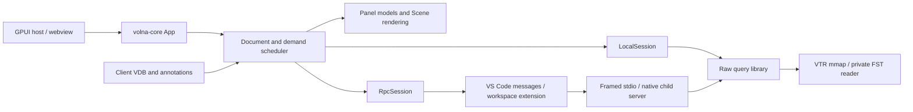

# Volna client-server design

> Superseded by [complete-object client-server loading](client-server-simple.html).
> The window-query design below is not the implementation target.

For an interactive explanation of the proposed final design, open the
[animated walkthrough](client-server.html). This document retains the research,
source evidence, detailed contracts and validation plan.

## Decision and scope

Support exactly two deployments:

| Deployment | Viewer | Query execution | Connection |
|---|---|---|---|
| Native local | Native GPUI with `volna-core` | Native query library in the same process, over mmap | Direct typed calls on background workers; shared immutable buffers |
| VS Code, local or remote workspace | WASM GPUI with `volna-core` in the webview | Native child process beside the trace, launched by the workspace extension | VS Code messages relayed to framed child stdin/stdout |

Native performance is a first-class acceptance gate. Its execution path has no
server process, wire codec, compression or serialization. VS Code supplies the
connection to the workspace host; Volna needs no independent network service.
Standalone browser querying and native remote connections are outside this design.
The existing minimal egui frontend keeps working through the native local session.

Use **viewport-driven queries through one asynchronous session interface**.
Keep the reader, decompression, raw-data indexes and expensive queries beside
the trace. Keep document and panel state, demand scheduling, rendering, VDB
interpretation and annotations in `volna-core` on the client. Native opening
uses an in-process session over the same query library and the memory-mapped
reader; it does not start a server or use a separate full-history viewer path.

This is a research proposal, not an implemented protocol or a performance
report for a remote viewer. It follows [GOAL.md](../GOAL.md), especially sections
2 and 8, and the [Volna architecture](../volna/volna/ARCHITECTURE.md). It proposes
breaking the current resident-hierarchy/full-history session contract directly.
No VTR format, Rust/C public reader API or frontend implementation changes are
made by this document. The stages below include their required documentation
and verification work when implementation begins.

Do not add an automatic bulk mode. A complete small trace can happen to fit in
bounded query results and remain cached; that needs no second API, policy or
representation. Explicit exports may iterate exact pages, outside interactive
rendering. Reusable native query indexes serve both deployments,
not permission to move presentation or whole recordings to the client.

## Evidence from the current implementation

The reviewed code is repository revision
`ff8ddd79b57260206ca9b7189c92b59f525bfff0`. Links below name the owning source;
the current implementation and the proposed replacement must not be confused.

| Current surface | Finding and design consequence |
|---|---|
| [`Session`, `OpenSpec`, `LoadRequest`](../volna/volna-core/src/session.rs) | `info()` and `hierarchy()` return resident references; `load_signal(s)` returns complete immutable histories. Only open and signal-load requests exist. Calls are blocking. The seam is useful, but serializing its present methods would not meet the remote objective. |
| [`LocalSession`](../volna/volna-core/src/data/vtr_source.rs) | Native VTR uses `Reader::open`; bytes use `Reader::from_bytes`. Opening builds a second scope/variable hierarchy with owned strings and a resident track list. It wraps `SignalData` without copying its shared history buffers. Move raw queries below the viewer and page metadata from its owner, rather than mirroring another whole hierarchy for the server. |
| [`Document`](../volna/volna-core/src/document.rs), [`App`](../volna/volna-core/src/app.rs) | Loads coalesce by signal and deliveries fan out to panels. Document generations reject results from previous opens. Pan/zoom within one document has no query revision because histories currently cover all time. Retain generation checks and add per-demand identities. |
| [`SignalHistory`](../volna/volna-core/src/data/history.rs), [`wave/paint.rs`](../volna/volna-core/src/wave/paint.rs) | The painter searches resident histories per pixel column, approximately `O(W log(changes/column))`; it does not draw every transition. This bounds drawing work, not history loading, retained bytes or network traffic. An aggregate must not masquerade as an exact history. |
| [`sidebar`](../volna/volna-core/src/sidebar/), [`workspace`](../volna/volna-core/src/workspace/) | Trees flatten expanded scopes; filters inspect resident variables. Global search stops at 5,000 rows, after accessing the full hierarchy. Restore resolves literal path segments and declaration occurrences synchronously. Paging therefore changes core models and restore preparation, not just transport. |
| [`Reader`](../core/vtr/src/reader.rs) | `value_at` uses frames, dirty-group lookup and column checkpoints. `changes` skips non-overlapping blocks but returns an unbounded vector for an **inclusive** interval and scans the selected column within overlapping blocks. No resumable bounded waveform query or summary API exists. |
| [`Reader` caches](../core/vtr/src/reader.rs) | Group cache capacity counts pieces, not bytes. Block time tables and decoded transaction/log blocks use `OnceLock`; they can accumulate. `clear_cache(&mut self)` needs exclusive access and clears all decoded caches. An outer response LRU cannot impose a reader memory bound. |
| [`transactions.rs`](../volna/volna-core/src/data/transactions.rs), [`vtr_transactions.rs`](../volna/volna-core/src/data/vtr_transactions.rs) | Optional facets distinguish unsupported from empty. Visitors preserve typed attributes, phases, events, stages, status, parent and relations; queries use inclusive overlap and backend order. The adapter resolves/copies complete records; relation queries collect vectors. Early visitor stop does not supply pagination or bound block decoding. No Volna transaction view uses these facets yet. |
| [`fst_source.rs`](../volna/volna-core/src/data/fst_source.rs) | FST owns a mutable reader behind a mutex and batches filtered full-history reads. Preserve batching and private locking. Bounded output alone does not prove bounded FST scanning, decompression or cancellation latency. |
| [`vtr_vdb::Debugger`](../core/vtr-vdb/src/lib.rs) | The existing debugger borrows `Reader`, walks its hierarchy during attachment and caches complete `SignalData` histories. Future client-side driver tracing must refactor this owner to request bounded raw evidence; its present evaluator cannot simply be placed behind an RpcSession. |
| [GPUI executor](../volna/volna/src/app.rs), [WASM entry](../volna/volna/src/lib.rs), [VS Code host](../volna/volna/vscode-ext/workspace.js) | Native loads run in background tasks. WASM decoding can block its single thread. VS Code `ready()` reads the whole trace through `workspace.fs.readFile`, posts an `ArrayBuffer`, then WASM receives the bytes. A remote workspace currently still transfers the file. |

### What the existing measurements establish

Use the checked-in [raw results](../bench/results/latest/results.json),
[workload manifest](../bench/results/latest/workloads.json) and
[benchmark report](BENCHMARK_RESULTS.md). They report a Linux Core Ultra 7 265K
host with approximately 96 GB RAM, not a constrained client. These are existing
measurements, not reruns at the reviewed revision. The original research checkout had no generated benchmark corpus and its reference
submodules were uninitialized. The measurements below are retained evidence from
that proposal; no new network, RSS, wire-size or summary benchmark was performed
for this deployment redesign.

| Workload | Recorded scale | Relevance |
|---|---|---|
| SCR1 AXI, real RTL | 1,445 signals, 2,803 variable declarations, 20,977,928 changes; VTR 1.19 MiB | Compression and aliases make file size and hierarchy declaration count poor substitutes for decoded-history size. |
| RSA-256 long, real RTL | 113 signals, 16,212,012 changes; VTR 310.27 MiB | Long wide-vector histories can dominate a laptop even with few rows. |
| C910 CoreMark, real RTL | 67,144 signals, 204,905 variable declarations, 596,626,011 changes; VTR 243.13 MiB | Large hierarchy plus high activity; the signal count alone understates hierarchy payload. |
| `long_sparse`, synthetic | 20,001 signals, 5.5M changes over about 2.5 billion ticks | Boundary lookup and long empty intervals matter more than returning changes. |
| `many_active`, synthetic | 200,001 signals, about 30M changes over 1,000 time steps | Metadata paging and vertical virtualization must work independently of time resolution. |
| `wide_bus`, synthetic | 129 signals, 569,969 changes; vectors up to 2,048 bits | Limits must count bytes, not only rows or transitions. |
| `tlm_1m`, synthetic | Reader reports 3M transactions and 2,999,996 relations; 1% window returns 30,007 transactions | A time window alone is not a result bound. Detail payloads and relation fanout require separate pages. |
| `ooo_1m`, synthetic; Kanata sample, real bundled example | Reader reports 1M transactions / 999,801 relations, and 4,041 transactions respectively | Pipeline stages and overlap need separate validation. The FTR expansion has different stage/relation counts; do not use its roughly 9M relations as VTR relation cardinality. |

The raw `load_100` queries report 1,193,355 returned changes / 52.13 ms for
C910 and 6,230,029 / 174.24 ms for RSA long. The driver samples signal IDs
with replacement; these counts are returned entries, not necessarily distinct
retained buffers. They include no network or viewer rendering.

There are two important limits to the existing query evidence:

* [`read.rs`](../bench/vtr-bench/src/read.rs) selects one random signal for the
  1% window. It returns **zero changes** on SCR1, both RSA cases, C910 and
  SCR1 x8. C910's 6.66 ms window result does not demonstrate dense-window speed.
  Its timing also includes opening a fresh reader; it is not a warm session RPC.
* [`tx_read`](../bench/vtr-bench/src/tx.rs) visits the entire recording before
  lookup, relation and window timing. TLM's 4.55 ms / 30,007-record window and
  OOO's 3.74 ms / 10,101-record window use warmed decoded caches. They do not
  prove cold-window performance or a bounded server working set.

### Calculations, not measurements

With the current `SignalData` representation, retained timestamps alone cost
`8 * distinct_loaded_changes` bytes. Loading every C910 signal would require
4,551.90 MiB (4.45 GiB) for timestamps, before values, metadata, decode scratch
or UI allocations. This is an all-signals stress case, not a claim about a
typical 32-row viewport. RSA long's corresponding timestamp floor is 123.69 MiB;
wide values add substantially more. Compression on the wire can reduce traffic,
but not these decoded allocations under the current representation.

Let `H` be full hierarchy bytes, `C` selected-history changes, `V` average raw
value bytes, `R` visible signals, `B` requested bins and `S` bytes per summary
bin. Bulk traffic is approximately `H + C*(timestamp_bytes+V)` before compression.
Bounded traffic is a metadata page plus at most the requested result budget,
typically `R*B*S` for summaries or bounded exact pages. Server query work need
not obey that bound: without indexes, a full-range summary still scans `C`.

For illustration only, 64 rows x 1,920 bins x an assumed 32 bytes/bin is
3.75 MiB: 315 ms of ideal transmission at 100 Mbit/s, before RTT, serialization
or queries. Wide-value bins can cost much more. A 32-row x 256-bin initial
overview at the same assumed size is 256 KiB, about 21 ms. Thus one bin per
pixel on every motion is not a sufficient bandwidth policy. Core demand must
budget bytes, coalesce motions, reuse coverage, and refine after motion stops.

For a cache miss, time to useful data is approximately
`queue + server_query + encode + RTT + bytes/bandwidth + decode + install`;
child startup and initial open add latency. Cached interaction
removes the RPC, not necessarily client paint work. Measure all terms separately.

## Prior art and what to borrow

* **Surfer/Surver:** the [remote guide](https://docs.surfer-project.org/book/remote.html)
  describes serving requested waveform data through an SSH tunnel. The published
  [server source](https://docs.surfer-project.org/src/surver/server.rs.html)
  serializes the hierarchy, exposes a time-table endpoint, and loads/compresses
  complete requested signals. Borrow a headless server, alias-aware batched
  loading and separation from the GUI. Reject that bulk payload granularity
  for Volna's large-history/laptop requirement. This is upstream published
  source, not a claim that the uninitialized pinned fork was inspected.
* **Perfetto:** the source study below supports stable resolution/coverage keys,
  keyed asynchronous demand, reusable aggregate indexes and a shared protocol
  client across transports. Retain VTR's indexed reader rather than requiring
  whole-trace SQL ingestion. Perfetto's visual depth/layer semantics and unlimited
  result accumulation are unsuitable for Volna's raw, bounded query contract.
* **VS Code:** [remote extension guidance](https://code.visualstudio.com/api/advanced-topics/remote-extensions)
  places workspace extensions beside remote files. It recommends message passing
  for webviews. Use workspace-side process ownership and opaque message passing
  as the sole VS Code transport; VS Code carries messages to the workspace host.
* **Existing VTR/Surfer research:** [reader and viewer rationale](RATIONALE.md)
  records shared immutable histories, cache eviction, and transaction interval
  searches that must retain long overlaps. Borrow those correctness lessons.
  Do not recreate a permanent full-history cache, or import Surfer's visual row
  packing into the raw query layer. No new compression or file-format idea is
  justified by this proposal.

### Perfetto source study

Inspected upstream commit `d3b1841f171c17161cb4faa1489052a09d8545d9`, including
the track implementations, asynchronous state helpers and their unit tests,
both UI engine adapters, the RPC handler/serializer, and the C++ counter/slice
mipmap operators and aggregate container. These are source findings; Perfetto
was not built or benchmarked here. Reproduce with a checkout of that commit;
the links pin the reviewed code rather than following `main`.

| Observed implementation | Consequence for Volna |
|---|---|
| [`BufferedBounds`][perfetto-bounds] quantizes coverage and retains it while it contains the viewport at the same resolution. [`CounterTrack.computeBucketSize`][perfetto-counter-track] rounds time resolution to a power of two. Bounds add one viewport duration on each side. | Use canonical power-of-two time bins and coverage-based reuse instead of a new arbitrary grid on each pan. Padding is a separate bandwidth tradeoff: do not copy the 3x window without measurement. |
| [`AsyncMemo` / `AtomicTaskQueue`][perfetto-memo] keep the latest pending task per memo key, serialize a queue's work and allow old data only when specified key fields change. [`unit tests`][perfetto-memo-tests] exercise first/latest execution, compatible retention and disposal after running work. | Make one small demand-slot state machine explicit in core. Distinguish dataset identity from requested coverage; a pan can retain coverage, while a new trace/filter cannot. Slots refer to the document cache, not private copies. Serialize only where resources require it, not all document queries. |
| [`SliceTrack.useData/createTables`][perfetto-slice-track] and [`CounterTrack`][perfetto-counter-track] separate a source-dependent prepared table from viewport-dependent data. Counter creation ingests all selected timestamps/values into an aggregate forest; filtering uses batched boundary searches and range aggregates. See [`CounterMipmapOperator`][perfetto-counter-op] and [`ImplicitSegmentForest`][perfetto-forest]. | Separate raw-index and reply lifetimes. A reusable ordered range-reduction index is an alternative to repeatedly scanning or immediately building a disk pyramid. It still has linear build/storage cost; fit it to reader-owned budgets and reuse existing indexes. |
| [`SliceMipmapOperator`][perfetto-slice-op] indexes each depth separately and combines counts with a longest-duration representative. The UI folds layer and depth together before querying. | Borrow hierarchical reduction, not representative-slice or depth semantics. A representative is not a complete transaction page or a general interval-overlap index. Volna's summaries remain raw counts and waveform reductions; visual packing remains client-owned. |
| [`EngineBase`][perfetto-engine] owns protocol handling; [`WasmEngineProxy`][perfetto-wasm] exchanges bytes with a worker, while [`HttpRpcEngine`][perfetto-http] uses WebSocket after HTTP status discovery. [`httpd.cc`][perfetto-httpd] labels POST RPC as a legacy path still used by Python, not the UI path. | Borrow separation of the protocol client from execution. Use only the VS Code relay for RPC and keep native in-process replies unencoded; Perfetto’s other transports are prior art, not deployment requirements. |
| [`query_result_serializer.cc`][perfetto-serializer] splits results at row boundaries using an approximate byte threshold; [`QueryResult`][perfetto-result] retains received batches and offers typed-column decoding. Counter/slice cancellation checks occur after awaiting engine queries. [`RPC sequence numbers`][perfetto-proto] detect stream loss, not request/response identity. | Streaming chunks are neither a total memory bound nor hard per-page limits. Retain Volna's byte admission, explicit request IDs and worker-side cancellation. Borrow compact immutable column buffers; do not duplicate generic row objects or interpret a UI cancellation flag as stopping server work. |

The concrete changes below are deliberately independent: stable time bins do
not require a server index, a demand slot does not require SQL or reactive GUI
state, and a shared protocol driver does not require a persistent connection.
Perfetto's helpers import UI redraw machinery and manage SQL resources; port the
ownership pattern into toolkit-free core, not the TypeScript object structure.

[perfetto-bounds]: https://github.com/google/perfetto/blob/d3b1841f171c17161cb4faa1489052a09d8545d9/ui/src/components/tracks/buffered_bounds.ts
[perfetto-counter-track]: https://github.com/google/perfetto/blob/d3b1841f171c17161cb4faa1489052a09d8545d9/ui/src/components/tracks/counter_track.ts
[perfetto-memo]: https://github.com/google/perfetto/blob/d3b1841f171c17161cb4faa1489052a09d8545d9/ui/src/base/async_memo.ts
[perfetto-memo-tests]: https://github.com/google/perfetto/blob/d3b1841f171c17161cb4faa1489052a09d8545d9/ui/src/base/async_memo_unittest.ts
[perfetto-slice-track]: https://github.com/google/perfetto/blob/d3b1841f171c17161cb4faa1489052a09d8545d9/ui/src/components/tracks/slice_track.ts
[perfetto-counter-op]: https://github.com/google/perfetto/blob/d3b1841f171c17161cb4faa1489052a09d8545d9/src/trace_processor/plugins/counter_mipmap_operator/counter_mipmap_operator.cc
[perfetto-forest]: https://github.com/google/perfetto/blob/d3b1841f171c17161cb4faa1489052a09d8545d9/src/trace_processor/containers/implicit_segment_forest.h
[perfetto-slice-op]: https://github.com/google/perfetto/blob/d3b1841f171c17161cb4faa1489052a09d8545d9/src/trace_processor/plugins/slice_mipmap_operator/slice_mipmap_operator.h
[perfetto-engine]: https://github.com/google/perfetto/blob/d3b1841f171c17161cb4faa1489052a09d8545d9/ui/src/trace_processor/engine.ts
[perfetto-wasm]: https://github.com/google/perfetto/blob/d3b1841f171c17161cb4faa1489052a09d8545d9/ui/src/trace_processor/wasm_engine_proxy.ts
[perfetto-http]: https://github.com/google/perfetto/blob/d3b1841f171c17161cb4faa1489052a09d8545d9/ui/src/trace_processor/http_rpc_engine.ts
[perfetto-httpd]: https://github.com/google/perfetto/blob/d3b1841f171c17161cb4faa1489052a09d8545d9/src/trace_processor/rpc/httpd.cc
[perfetto-serializer]: https://github.com/google/perfetto/blob/d3b1841f171c17161cb4faa1489052a09d8545d9/src/trace_processor/rpc/query_result_serializer.cc
[perfetto-result]: https://github.com/google/perfetto/blob/d3b1841f171c17161cb4faa1489052a09d8545d9/ui/src/trace_processor/query_result.ts
[perfetto-proto]: https://github.com/google/perfetto/blob/d3b1841f171c17161cb4faa1489052a09d8545d9/protos/perfetto/trace_processor/trace_processor.proto

## Comparing the two approaches

| Concern | Complete histories and full hierarchy | Viewport-driven queries (recommended) |
|---|---|---|
| First useful view | Can wait for substantial metadata/history; progressive per-signal delivery helps but one hot signal remains huge. | Open small metadata, fetch visible hierarchy and coarse coverage; exact detail follows. Cold summary construction can still be slow. |
| Subsequent latency | Loaded signals can pan, zoom and sample without RTT, including offline. | Hits are local; misses pay RTT and query cost. Keep valid cached coverage visible and mark gaps/loading. |
| Bandwidth | Cost follows selected signals' entire lifetime plus the full hierarchy. Excellent reuse if the user truly explores all of it. | Cost follows requested coverage and detail budgets; repeated uncached pans can retransmit data. No file-size-independent total bound for an unlimited investigation. |
| Client RAM / CPU | Retains selected decoded histories and all metadata; low extra query CPU after load, but potentially large initial decode and allocations. | Byte-budgeted pages and summaries; more scheduling/bookkeeping, bounded decode tasks and client-side rendering/semantics. |
| Server RAM / CPU | Full decodes and serialization can be large; later client navigation is free to the server. | Active windows share reader work; repeated summaries/searches cost CPU. Needs byte-accounted caches, admission and cancellation. Metadata/index RAM can still scale with file size. |
| Caching | Simple per-signal reuse but expensive eviction and reload; aliases must share. | More keys (snapshot, query, coverage, resolution); immutable pages share across panels. Start without speculative prefetch or a second result cache on the server. |
| Cancellation | Whole loads waste work after row removal; giant responses can delay new work. | Cancel obsolete demand between bounded work units; bounded replies limit wasted transfer. Cancellation cannot preempt arbitrary decoder calls. |
| Concurrency | Independent full loads can multiply peak memory; FST serializes its reader. | Small worker pool and byte reservations; batch by backend and use fair service between sessions. |
| Consistency | Easy for a fixed file; a reload invalidates everything. | Same immutable snapshot rule plus query/revision and continuation validation. |
| Failure recovery | Fully loaded rows remain usable; interrupted histories need restart or a new chunk protocol. | Retry exact query/page under a valid snapshot; incomplete data remains explicitly incomplete. Reopen on server/session loss. |
| Complexity | Smallest change to today's waveform viewer; fails the required large remote use case and does not solve dense transactions. | Changes sidebar, restore, renderer inputs, reader APIs and transport. Larger initial work, but one contract covers local and remote navigation. |

Bulk is attractive for small recordings and repeated offline exploration. It is
rejected as the main design because no bound on selected-history or hierarchy
size follows from screen size. A hybrid with size prediction, promotion,
demotion and two load representations lacks measured benefit here. Bounded
exact pages already retain the useful small-data case without such machinery.

Also reject rendered pixels/display lists on the wire, server-side VDB-driven
lane assignment, downloading VTR byte ranges for browser-side queries, and an
arbitrary SQL/expression RPC. They respectively cross ownership boundaries,
move expensive decode back onto the laptop, or add a query language and resource
control problem before the concrete operations need one. Subscription synchronization is unnecessary for immutable paged queries.

## Ownership and object model



The diagram shows the same native query library in two execution contexts.
Put backend-neutral request/result types and query implementations in proposed
`core/vtr-query`, with native reader dependencies behind a native-engine feature.
WASM builds only the contracts and codec. Keep backend modules private and keep
GUI, viewer models and VDB interpretation out of the query library.
A thin `tools/vtr-server` binary runs that engine over stdio for VS Code.
The extension owns one child per open trace document, shared by that document’s
panels. No listener, daemon discovery or generic transport plugin system is needed.

`volna-core` owns `Session`, `LocalSession`, `RpcSession`, document data demand,
client caches and render inputs. Transport/executor implementations are injected
platform services; they contain no viewport policy. `Document` owns one session,
its snapshot, shared navigation, annotations, metadata pages and query cache.
Panels retain row identities, formats, selection and independent/linkable
navigation. They borrow immutable result handles rather than each owning full
histories. `App` merges demands from all visible panels; hiding a panel releases
its pins, not its saved rows. Duplicate declarations can retain distinct labels
while sharing one signal's query data. This also preserves the current shared
cursor and independent viewport object model.

Frontends continue commands in, events out, `take_requests()` / `deliver()` and
toolkit-native chrome. The minimal egui frontend receives compatibility changes
to use this seam and retain its current behavior; no transaction/source feature
parity is required. Scene generation consumes only already available data.

### Session and query surface

Illustrative API shape, not a frozen Rust signature or an additional public C API:

```rust,ignore
trait Session {
    fn info(&self) -> &SessionInfo; // small, immutable, no I/O
    fn execute(&self, request: Request, cancel: CancelToken)
        -> QueryFuture<Result<Reply, QueryError>>;
}

struct Request {
    id: RequestId,
    snapshot: SnapshotId,
    query: Query,
    limits: Limits, // records, encoded bytes, decoded bytes, work/deadline
    continuation: Option<Continuation>,
}

// Query and Reply are typed enums; no GUI objects or reader handles.
// LoadRequest adds document generation and the consumer's demand revision.
// A reply contains its query identity, coverage, completeness and continuation.
```

`QueryFuture` is the platform-appropriate boxed future (no `Send` requirement
for WASM relay futures). Native `LocalSession` submits blocking work to a bounded
executor; polling never runs reader work on the UI thread. It returns shared
immutable columns directly, without encoding or copying them to imitate a wire
reply. Local limits account for actual retained and scratch bytes; encoded-byte
limits apply only at the RPC boundary.

`RpcSession` owns version/session checks, correlation, limits and errors over the
VS Code message bridge. The extension relays opaque envelopes to the child;
it does not interpret query semantics. Cancellation is a local token or a remote
cancel envelope. Opening is asynchronous: native `OpenSpec` supplies a local path;
VS Code supplies a document resource handle bound by the extension to its child.
No endpoint URLs, credentials or transport selection belong in saved workspaces.
WASM decodes bounded pages outside layout/paint callbacks under an install budget;
measure decode duration as UI-thread work, rather than claiming async scheduling
makes it off-thread. Reduce page size if that work misses the frame budget.

`SessionInfo` contains snapshot and session identities, optional design build ID,
timescale, available time range, recovery status, cheap counts and operation
capabilities/limits. Large attributes, tracks and strings are paged metadata,
not part of open. Capabilities describe supported operations, including exact
versus aggregate kinds; empty is a successful result, not unsupported.

| Query family | Parameters and bounded raw result |
|---|---|
| `Children`, `SearchHierarchy`, `ResolvePaths` | Parent/root, kind filter and declaration-order continuation; search with documented case-folded substring semantics and scope restriction; batches of literal path segments and optional declaration occurrence. Return raw scopes/declarations/streams/generators, stable snapshot-local IDs, parent and signal identity, raw types and child availability. Resolve returns found/missing/ambiguous. No full paths for every node at open, and no global time table. |
| `WaveWindow` | Signal batch and half-open interval; exact predecessor plus ordered changes, limits and continuation. |
| `WaveSummary` | Signal batch and integer time grid; bounded typed aggregate bins, explicit covered region and completeness. |
| `ValuesAt`, `FindChange` | Bounded signal/time pairs, or signal + direction + exclusive event position and optional raw edge/value predicate. Return exact samples or an ordered hit, resumable exhaustion, or proven no hit. Useful for cursor, previous/next edge and trace-driver stepping without fetching histories. |
| `Transactions`, `Transaction` | Track/time filter and page, or ID. Default list returns raw ID, generator, begin/end, parent, kind and status. Attributes, events and stages are separate paged record parts; list queries do not copy every detail. |
| `TransactionSummary`, `Relations` | Raw track/time-bin counts, or endpoint + direction + optional raw relation-kind filter with a continuation. Relation endpoints outside the window remain addressable; never recurse transitively by default. |
| `Metadata`, `RecordPart`, `ValueBytes` | Page large attributes/record collections; read a byte range of a snapshot-scoped large value reference. Preserve total length and type. This makes even one huge string, vector or transaction retrievable without an oversized response. |

The first implementation needs waveform and hierarchy families plus large-value
handling; transaction families are the next stage, not dummy methods in FST.
Use typed enums with operation capabilities, retaining the current optional-facet
semantics. Search, metadata browsing and raw predicates run on the file host;
interpreting a VDB expression, grouping by a profile, or assigning colors does not.

Paged hierarchy requires a sparse core metadata store and list states for
unrequested/loading/complete/error pages. Retain only visible pages and bounded
recent pages; expanded-node identities do not pin every descendant. Search pages
use stable declaration order and explicit continuation, rather than a hidden
5,000-result cutoff. Save durable literal paths when rows are selected. Restore
performs batched `ResolvePaths` during asynchronous prepare, then commits
atomically; missing/ambiguous/unavailable locators survive saving. Resolving a
deep path must not force one client round trip per hierarchy level.

### Exact time, coverage and summaries

All timestamps/IDs remain integers through Rust, wire and JavaScript. Never
round-trip `u64` through a JS `Number`. Use a time-bound enum with `Tick(u64)`
and `AfterMax` for an exclusive endpoint beyond `u64::MAX`; integer arithmetic
for grid generation uses checked wider intermediates. Empty `[a,a)` is valid.

An exact waveform page describes `[start,end)`, the value immediately **before**
`start`, and changes at `start` in source order; it excludes changes at `end`.
The predecessor is tagged known, backend-initial/default, or unavailable, so
an unknown sample cannot become a known logic X. Dump-off/blackout spans are
raw coverage metadata; do not synthesize changes across them. Event signals
carry occurrences, not held values. Preserve packed 2/4/9-state codes, real bits
(including NaNs), and variable-length bytes; client translators choose display.

Continuation identifies a backend position, including same-time event ordinal
and block position as needed. Resuming by timestamp alone loses or repeats
changes when a page cuts through one timestamp or a timestamp spans blocks.
The first page's predecessor plus concatenated pages must equal the exact
reference history for the interval. A partially returned timestamp is not
complete coverage through that time. Keep partial pages out of exact rendering
until their relevant coverage is proven complete.

For summaries request `Grid { start, bin_width_log2, bin_count }`: bin width is
`2^bin_width_log2` ticks and `start` must align to that width from tick zero.
The client chooses the smallest power-of-two width that fits its resolution and
byte budget, rounds requested coverage outward to bin boundaries, and requests
only missing bins. Use checked `u128` arithmetic; exponents 0 through 64 are
valid, with exponent 64 allowing only one bin `[0,AfterMax)`. Do not move the
grid origin to match a pan or truncate boundary bins to the recording range;
describe unavailable coverage within them. Empty demand issues no summary query.
No pixels, row heights, colors, labels or translator names appear in the query.
A time grid remains a numerical aggregation request usable by CLI/MCP clients.

Key cached bins by `(snapshot, raw_selector, aggregate_kind, level, bin_index)`,
where the raw selector includes signal/track identity and any raw filters,
independently of which batch fetched them. Two views at the same level can share
overlap even if their batch bounds differ. Existing coverage remains usable
until the viewport leaves it or needs finer detail. For example, at width 16,
`[101,149)` requests `[96,160)`; panning to `[103,151)` requests nothing new when
those bins are already complete. Exact `WaveWindow` queries retain arbitrary
half-open endpoints. This needs no separate tile service or server pyramid.

Each complete digital bin contains entry value (strict predecessor), change
count, first/last change times and values when present, exit value, and raw
availability spans/references. Count source occurrences, even if values repeat.
Zero/one change is sufficient for exact held-value/edge geometry in that bin;
multiple changes are explicitly aggregate data and are drawn by the client as
dense activity. No summary supports exact transition inspection, edge stepping
or expression evaluation. Event bins count occurrences without a held-value
interpretation. Real summaries additionally contain finite min/max and counts
of NaN/infinities; min/max is over held values that intersect the bin, not just
changes. Oversized values use typed value references, never silent truncation.

Initially request a coarse grid, then refine exact windows or bins that the
client needs. Budget all fields and group fewer rows/bins per request when values
are wide. Responses never silently coarsen the requested grid. A work limit
returns only completed bins and a continuation; unfinished bins are unavailable,
not zero. Do not keep a growing per-request history to complete a summary.
An unfinished bin's continuation carries its scan position and a bounded
accumulator (counts, extrema and value references), not the scanned events.
Adjacent complete bins can be merged for coarser display; incomplete bins cannot
prove absence of events. Coarsening must merge a full set of aligned child bins
in time order. Complete waveform bins support this; transaction overlap counts
do not, since one transaction can intersect both children. Fetch transaction
overlap counts at the requested level instead of summing them. Coarse coverage
can remain visible while finer bins load, but cannot be relabeled as fine data.

Use the same half-open query convention for transactions. Positive-duration
`[begin,end)` records overlap if `begin < query.end && end > query.start`;
zero-duration records are included when `query.start <= begin < query.end`.
Translate this explicitly at the currently inclusive reader boundary. Return
original times, including a transaction that begins before and ends after the
entire window. An unfinished stage preserves its optional end. Stable pagination
uses backend record order and a position token; do not sort a whole recording
in memory to promise chronological pages. Clients sort a complete bounded set
by `(begin,id)` when a view needs it.

`TransactionSummary` bins report counts of starts, ends and overlapping records
for each requested raw track, with point-event counts separate. Overlap counts
across bins are not additive distinct counts. No summary decides instruction
lanes, squash styling or which overlapping record should be selected. At detail
zoom the core lays out the complete bounded result. At excessive density it
shows an aggregate and requests narrower time/track filters on drill-down.
Stable globally packed visual lanes across unloaded history cannot be guaranteed
by this minimal interface. A future pipeline view needing that must define
client-owned semantics and validate a raw index/query extension; it must not
quietly add presentation row IDs to this server.

### Reader work and cache ownership

Add missing traversal, seek and continuation operations at the reader's owning
layer. Do not implement `WaveWindow` by loading a complete `SignalHistory` or by
collecting `Reader::changes` then clipping. Reuse block/group indexes and frames,
with record iteration that can stop, resume and check cancellation. Expose a
strict predecessor operation where `value_at(start)` is insufficient. Batch
signals to reuse group decompression and FST filtered scans.

Replace unbounded transaction/log/time-table retention with reader-owned byte
accounting and eviction before promising a server working-set bound. Immutable
Arcs may outlive eviction; count pinned bytes as well as cached bytes. Also
reserve decode scratch, output builders and serialization buffers. A single
compressed block may exceed the budget: inspect sizes before allocation and
reject with a resource-limit error, or develop incremental decoding at its owner.
`clear_cache` after an unbounded decode is not an admission policy. Coordinate
cache population to avoid concurrent duplicate decompressions of the same block.

Implement a reusable raw signal index as the primary warm-query path in the
native query library, shared by both deployments. Reuse immutable decoded
histories where they fit a reserved budget; use binary searches for samples,
changes and bin counts, plus ordered range reductions where extrema require
more information. Share construction across requests and measure build cost,
warm latency and eviction behavior. The local viewer must benefit from this
same preparation without serializing its results.

For a history that cannot fit, use bounded reader traversal and measure its
cold/full-range summary cost. Clipping an unbounded `load_signals` or `changes`
result is not a bounded fallback. If repeated scans miss the latency gates,
add coarser raw block aggregates at the reader’s owning layer before claiming
large-trace readiness. Define ordered reductions for counts, first/last and
extrema; combine predecessor and availability information explicitly.

Index identity is `(snapshot, raw_selector, aggregate_kind)`, independent
of viewport, panel and VDB. Build it on demand under a byte reservation; share
construction, lease immutable handles to queries, and evict at the owning reader
when unpinned. A viewport change must not rebuild it. Start with a budgeted
in-memory index only where its measured build/storage cost fits; reuse reader
timestamps/checkpoints instead of adding another full history. Large indexes may
need coarser block aggregates or disk backing to meet the same limits. Persist a
versioned, snapshot-bound sidecar only if repeated-open cost justifies it; record
build time, disk space, memory and amortization. No public prepare/drop-table
RPC, VTR format change or permanent pyramid is needed merely to cache indexes.
Likewise, add interval/endpoint indexes for transaction overlap/relations only
when header pruning and bounded traversal fail the measured gates.

## Request lifecycle and resource bounds

1. Open asynchronously. Create a document-owned session with an immutable
   snapshot, capabilities and small `SessionInfo`. Fetch root metadata and
   restored row locators in bounded batches.
2. `App` computes demand after navigation/layout changes using effective panel
   viewports, visible rows and cursor. Deduplicate aliases and identical queries
   across panels. Normalize summary coverage to the canonical time grid.
   Coalesce changes to the latest demand before scheduling;
   paint/tick never await requests. Dispatch a coarse overview while motion is
   active and refine after it settles. Fetch whole boundary bins but no additional
   speculative neighbor padding initially; measure padding separately.
3. Match complete client-cache coverage first. Queue misses by priority: explicit
   cursor/detail, visible coverage/metadata, then refinement. Use fair rotation
   among panels so one active panel cannot starve the others.
4. Attach `(document_generation, demand_revision, request_id, query_key)` locally
   and `(session_id, snapshot_id, request_id)` remotely. Wire query keys contain
   raw parameters only; panel IDs and viewport revisions remain client state.
5. Reserve budget before dispatch. Initial **tuning hypotheses**: 4 in-flight
   data requests per client, 64 KiB request body, 1 MiB encoded response,
   4 MiB decoded response and 4,096 records per page; a summary bin counts as a
   record. Cap queued demand and completion bytes too. The server negotiates
   lower limits and also imposes global/session worker and byte limits.
6. Execute under a deadline/work quota. Expensive readers run on workers;
   control/cancel is serviced separately from decode. One serialized FST reader
   is acceptable initially, with a bounded queue. VTR concurrency must be
   measured for lock contention and memory, not set to the machine's core count.
7. Return one bounded page with `Complete`, `Partial { next, coverage }`, or
   structured error. A work-exhausted scan may return an empty page with an
   advancing continuation; that is not an empty complete query. Never return
   an unchanged continuation in an endless retry loop. Large records refer to
   paged values/parts, rather than requiring an exception to the byte cap.
8. Decode bounded relay replies outside layout/paint with a per-tick budget. Install
   bounded immutable handles and invalidate relevant views. Accept results only
   for the current snapshot/generation; apply to a consumer only if its demand
   revision still needs the coverage. A stale pan response may enter the bounded
   cache, but cannot replace newer data or clear its loading/error state.
9. Superseded demand replaces its pending slot request. Keep a bounded running
   page if its coverage still serves the latest demand; a pixel movement is not
   by itself a reason to cancel it. Remove obsolete subscribers and cancel work
   that serves none. Drop queued tasks immediately; running workers
   check cancellation between bounded decoder units. Closing invalidates the
   generation first, cancels requests and closes the document session. Late success,
   failure and cancel acknowledgment are harmless.

Represent each logical consumer demand (wave coverage, hierarchy page or
inspector) as a small core-owned slot: dataset key, latest requested coverage,
last usable cache handle, running request and **one replaceable pending request**.
The dataset key includes snapshot, raw identities, query kind and raw filter;
coverage includes time/range/resolution. Slots contain handles and status, not
another result cache. The document scheduler deduplicates slot requests, applies
global budgets and dispatches pages fairly. Cache hits can satisfy a slot without
waiting for its obsolete running request to finish.

Allow previous data during coverage/resolution changes only for the same dataset
and only over its proven coverage. A changed snapshot, signal set or raw filter
clears the slot's retained handle immediately. Presentation-only formatting does
not invalidate raw data. Errors belong to the exact request key; a late failure
cannot replace a newer result. Start with this explicit state machine, not a
general reactive dependency graph. Prepared backend indexes have reader-owned
lifetimes; do not expose Perfetto-style SQL resource creation/disposal in slots.

Use one byte-budgeted client data cache per document for metadata, exact pages,
summaries and record details, keyed by snapshot and canonical raw query/coverage.
Start with 128 MiB on a constrained client, including pins and queued decoded
results. Account allocations rather than counting entries. If visible demand
exceeds the budget, reduce requested resolution/rows per delivery, release
refinement and show unavailable portions; pinned data cannot bypass the limit.
Panel state and rendering/text buffers have separate measured budgets. A cache
miss is explicit state, never a synchronous load hidden in `SignalHistory`.

The server initially shares reader caches within one open snapshot, not a second
unbounded cache of encoded replies or full histories per client. Queue entries
retain query descriptions, not decoded data. Begin with two decode workers per
process and at most one active scan per session, plus control handling; tune
after measurement. Reserve output capacity globally so slow clients cannot
accumulate completed replies. Stop scheduling their continuations. Proposed
server decoded/scratch/output budget is 512 MiB; resident metadata/indexes are
separately charged on open against a configured process ceiling. Memory mapping
does not mean zero RSS: report file-backed resident pages separately. Reject
excess opens cleanly rather than promise constant server memory for all files.

## Protocol and deployment

### Native local: direct execution

`OpenSpec::Path` → `LocalSession` → bounded background executor → native query
library → mmap/private FST adapter. Query and reply types are shared with RPC,
but the local path never invokes a codec. Immutable buffer slices can reference
reader-owned storage; aliases and panels share backing, and pinned storage is
charged once to the process budget. Do not build a second full-history viewer.
A small complete history can fit in an ordinary exact result; reuse it through
the same coverage contract. Tune local batching independently of remote wire
page sizes, while preserving cancellation and memory bounds.

### VS Code: native child and WASM viewer

The workspace extension starts one native `vtr-server --stdio` child per open
trace document, using an argument array and a host-resolved trace path. The child
runs on the workspace host, which is remote in Remote SSH, tunnels and containers,
and local in local VS Code. Bundle/select the binary for the workspace host’s
OS and architecture. A VS Code environment without a native workspace extension
host cannot run this deployment; no standalone service fallback is proposed.

The path is WASM `RpcSession` ↔ webview messaging ↔ workspace extension ↔ child
stdin/stdout. The existing bridge still carries themes, commands and workspace
save messages. Route trace envelopes separately by document and incarnation.
The extension validates envelope size and routing, forwards opaque binary data,
and owns child startup, exit reporting and shutdown. It never reads the trace
into the webview or translates `u64` fields through JavaScript numbers. Validate
the actual binary representation supported by VS Code messaging; account for
structured-clone copies and any required envelope conversion in relay budgets.

Use versioned **Protobuf envelopes over length-prefixed stdio frames**. Retain
the proposal’s codec choice; transport simplification does not require a new
schema format. The wire messages are `Hello/Welcome`, `Open/Opened`, `Query/Reply`,
`Cancel`, `Close`, and typed errors. Request IDs correlate concurrent replies;
logical pages carry completeness and continuations. Each frame starts with a
little-endian `u32` payload length, checked before allocation. Stdout is protocol
only; diagnostics go to stderr. Reject incompatible versions explicitly.

One query produces one bounded page. The client requests continuation only when
needed; there is no unlimited result stream. Initial caps are 64 KiB per request,
1 MiB encoded per reply, 4 MiB decoded and 4,096 records, with four outstanding
data queries per document. Validate nesting, counts, references and allocations
inside the decoder. Large values and record details use paged parts. Start with
compression disabled; measure relay traffic before adding a codec.

Backpressure covers every hop. `RpcSession` reserves reply capacity before
issuing a query. The extension bounds both directional queues and acknowledges
reply delivery only after WASM has consumed or discarded it. The server retains
at most the negotiated outstanding reply allowance. Pause child stdout reads
when delivery capacity is exhausted; keep stdin/control processing active.
Cancel and close take priority over unsent data frames, but cannot interrupt a
frame already being written. Bound frame size and measure that delay. Reserve
control queue capacity at both ends; an unresponsive webview cannot accumulate
unbounded messages. Dispose closes stdin, terminates the child after a bounded
grace period and releases queued buffers. No idle leases or persistent daemon
state are needed.

Keep packed column buffers, exact integer values, per-query errors and explicit
snapshot checks. A malformed frame or broken child pipe fails the session;
unsupported operations or resource limits fail the affected query. VS Code owns
remote connectivity; there are no HTTP routes, listening ports, CORS/CSP network
rules, service tokens, SSH subprocesses or native remote transport adapters.

### Snapshot consistency and recovery

Version one serves immutable recordings, including a fixed recovered snapshot
of a finalized damaged file where the reader supports recovery. Live tailing
and in-place mutation are not supported. The trace owner must publish completed
files atomically and leave opened files immutable; mmap can be unsafe under
concurrent truncation, so modification detection alone is not protection.

An open receives a server-incarnation/session ID and an opaque snapshot ID tied
to that opened file. It is not `design.vdb_id`: many recordings share one design.
Continuations are size-bounded, opaque, validated positions bound to
the session, snapshot, query parameters and codec version. They hold no growing
server-side result set and expire when the document session closes.
Close and cancel are idempotent. Unknown or stale tokens
are errors, never interpreted against a replacement file.

While the server/session survives, retry a failed immutable query/page with a
new request ID and the same continuation. Do not treat an interrupted body as
a complete page. A bounded active-request registry handles cancel races, including
a cancel arriving just before its query; cancellation tombstones expire after
the maximum request deadline. Local deadline expiry also drops pending demand,
since remote cancel delivery is not guaranteed.

On disconnect retain valid cached data with a disconnected state, keep navigation
responsive and retry with bounded backoff while demand remains. On document-session loss,
child restart or changed file, reopen, increment document generation, invalidate
old query caches/tokens and resolve saved paths again. Do not reuse data merely
because path, size, mtime or design ID match. Avoid hashing a huge file on every
open by accepting cold caches after reopen in version one. Crash recovery does
not need persistent server sessions, transactions or replay journals.

On temporary webview disconnection, preserve a session only if the same extension
and child incarnation explicitly acknowledge it. If either is lost, reopen with
new identities. Extension shutdown/EOF terminates the child; hidden panels merely
release demand. Document disposal is distinct from hiding a webview.

## Future views and investigations

| Workflow | Client ownership | Raw query extension/use |
|---|---|---|
| Pipeline, transaction table, Gantt-style view | VDB interpretation of instruction/stage semantics, lane assignment, labels, colors, filtering UX and layout in core panel models. | Paged track metadata, overlap windows, raw density summaries, bounded stages/events and relation expansion. A selected transaction is pinned by ID, independently of the time window. |
| Source view | Attach VDB by exact build identity, interpret source mappings, select visible symbols and render source with cursor values. | Batch `ResolvePaths` and `ValuesAt` for visible symbols. Use native file I/O locally and VS Code file services in the extension deployment; artifact retrieval stays outside the trace query API. |
| Schematic | Client builds and lays out a bounded VDB neighborhood; selection and annotations remain client state. | Batch sample the currently displayed nets. The server does not emit connectivity or driver/load semantics as trace metadata. |
| Temporal driver investigation | Client evaluates supported VDB expressions and explains hypotheses, with explicit unsupported constructs. | Batch exact samples and raw previous/next-edge searches under a work budget. Keep a resumable client investigation state; avoid one RTT per expression leaf. Deep sequential dependencies may remain RTT-bound and require future evidence-driven API work. |
| MCP/agent control | Thin adapters drive toolkit-independent commands, selections and readable evidence; stable snapshot/time/signal references and comments live with the client investigation. | Reuse bounded query families for headless raw exploration. Do not put an embedded chat or VDB evaluator into the server to enable this. |

The [VDB implementation and identity rules](VDB_RTL.md) already exist separately;
Volna attachment remains planned. Remote source/VDB access is a distinct artifact
boundary through native or VS Code file services. Larger VDBs may eventually need
paged artifact retrieval, but semantic interpretation remains on the client.
Refactor `vtr_vdb::Debugger` at its owning layer into semantic evaluation over
an evidence provider with batched, resumable sample/edge demands. Keep its
existing local CLI usable through that provider; do not retain a separate
full-history implementation for remote investigations. This is future VDB work,
not a prerequisite for the first waveform-only server.
None of these extensions justify returning a server-computed Scene or visual
transaction row window. Unsupported global lane packing and deep driver-query
latency are explicit limitations to investigate, not hidden claims of completion.

## Staged implementation and validation

The following are proposed acceptance gates, not measured achievements. Keep
research results reproducible under `bench/` with commands, workload identities,
hardware, process limits and raw outputs; record enduring decisions in
`RATIONALE.md`, not dated progress diaries. Do not mark remote large-file support
complete solely because a transport round-trip test passes.

### 1. Establish the native baseline and a minimal relay spike

Reproduce the existing suite using [BENCHMARKS.md](BENCHMARKS.md), then add a
query/transport experiment harness. Compare a bulk baseline and the proposed
bounded path using identical signal sets and navigation scripts. Select quiet,
median and busiest signals, aliases, widest vectors, and dense/empty windows;
do not repeat the existing random-empty-window blind spot. Include every workload
above, SCR1 x8, a million-declaration synthetic hierarchy, large strings, same-time
event bursts, long-overlap transactions and high-fanout relations. Add a real
multi-gigabyte waveform and a real substantial transaction trace when available;
label the lack of either as an evidence gap, not synthetic equivalence.

Test in-process local, loopback remote, and controlled 10/50/150 ms RTT at
10/100/1,000 Mbit/s. Use Linux network shaping on a dedicated test link and
record actual RTT/throughput. Test a client with 8 GB RAM and two CPU cores
available; record browser/WASM versions. Exercise native and VS Code local,
Remote SSH, tunnels, containers and a browser-hosted remote workspace. Measure
the extension relay’s byte representation, copies, queue bounds and throughput.
Acceptance: no trace bytes read into the webview, exact `u64` round trips, child
startup/disposal, cancellation and reconnect in every supported workspace host.

Measure canonical-bin reuse with repeated small pans, zoom-boundary oscillation
and two panels at overlapping ranges. Compare no extra padding, one-quarter
viewport per side and Perfetto's one-viewport-per-side policy under the same
visible quality and total byte budget. Record useful/canceled bytes and request
counts as well as latency; adopt padding only if the workload benefit justifies
extra traffic. Compare scans, reusable in-memory aggregates and persisted
aggregates separately, including cold build/reopen cost and index eviction.

Record first useful overview versus first exact view, wire/decoded bytes,
client and server peak/steady memory (heap, scratch, pinned data, mapped RSS),
CPU, I/O, cache hits, canceled work, and p50/p95/p99 query/frame times. Distinguish
cold OS cache, warm OS cache/cold reader, warm bounded reader and client hits.
Use at least three performance runs, best-of-N for existing suite comparisons
and latency distributions for interaction; report variation, not a few-percent
win. For reader/decode or format changes use a HEAD worktree baseline, P-core
pinning on the Linux benchmark host, and the full suite. Report file size,
write time and read time together; this design authorizes no unmeasured trade.

### 2. Implement bounded local query contracts at their owners

Implement metadata pages, strict predecessor, exact waveform pages, raw samples,
summaries, large-value retrieval and byte-accounted reader work. Test the local
API before adding remote UI. Acceptance:

* Concatenated exact pages equal complete reference results for all supported
  types, aliases, zero/maximum time, same-time changes across blocks, sparse
  predecessors, blackouts and unavailable initial samples. No missing/duplicate
  event across any page boundary, including one-record and one-byte stress limits.
* Every complete aggregate equals a direct exact reference reduction. Verify
  boundary values, counts, events, NaNs/extrema and coverage; a partial response
  cannot pass as an exact value or a complete empty interval.
  For waveform reducers, verify ordered composition across blocks and same-time
  events, and equality of a parent bin with its complete aligned child bins.
  Verify grid normalization at zero, powers-of-two and `AfterMax`; two normalized
  requests for the same bins must share cache identity. Transaction overlap
  counts must be queried/reduced from records rather than summed across bins.
* Metadata traversal/resolution returns every declaration exactly once, preserves
  literal names/ambiguity, and reaches deep paths in one bounded batch query.
  Byte limits include large names/attributes, not only waveform values.
* All response and decode allocations fit negotiated limits, or fail explicitly
  before oversized allocation. Target at most 50 ms from local cancellation
  signal to stopping CPU work on the test corpus; remotely measure cancel
  delivery separately. Measure the largest decoder unit and change its owner
  if it prevents this target. Report non-interruptible OS I/O separately rather
  than treating a canceled future as proof that the worker stopped.

FST uses the same logical result tests. Establish whether its reader can support
time filters and cancellation with bounded work. If not, improve the private
backend or use an explicitly prepared indexed recording on the server; do not
claim scalable remote FST by clipping fully decoded histories. Existing native
FST behavior must remain available through the same session contract.

### 3. Move core models to asynchronous demand and bounded render data

Replace resident full hierarchy/history assumptions in sidebar, workspace prepare,
wave rows and painting. Run the same command/navigation script against an
in-process session and a delayed, reordered, failing fake session. Acceptance:

* Current native waveform behavior and saved-state semantics survive. Duplicate
  rows/panels share immutable results; linked and independent viewports request
  appropriate coverage. The minimal egui frontend still builds and works.
* Closing, reopening, hiding, deleting/re-adding rows and rapid alternating
  pan/zoom cannot install stale results or stale errors. Delay every completion
  ordering, including cancel-before-query and close-before-open-result.
  With A running and B then C requested in one slot, only C remains queued;
  complete A for cache reuse only under its original dataset/coverage identity.
  Returning to cached A while C is pending must render A immediately. Retain
  compatible coverage during pans, clear it on dataset/filter changes, and
  prove pending work remains bounded by live slots, not input-event count.
* A 30-minute scripted pan/search/zoom session plateaus within the configured
  128 MiB client data budget, including pinned and queued data; visible content
  gracefully reduces detail if the budget is insufficient. Record total process
  memory separately, with an initial target below 512 MiB above the empty viewer.
* With 150 ms injected RTT or no server, input and paint perform no synchronous
  query/network/decode calls. Target p95 frame work below 16.7 ms and p99 below
  33 ms for 32 visible rows at 1,920 logical pixels on the constrained client;
  show loading/aggregate coverage while data is absent. Frame responsiveness is
  not evidence that queries meet latency targets.

Native performance gate: compare the current committed native viewer with the
new local session on the same hardware and navigation scripts, with no RPC codec
linked into the execution path. Report cold open, first useful paint, warm query,
frame p50/p95/p99, allocations and peak memory for small traces and busy real RTL.
Target no more than 5% regression in warm frame and query latency over repeated
runs; investigate noise before accepting a regression. Verify shared buffer
identity across aliases/panels and no serialization-sized copy on local delivery.
Cold index construction must be reported separately, not hidden before timing.

### 4. Add the stdio child and VS Code relay

Use one conformance corpus through native local sessions and the shared
`RpcSession` driver through framed stdio and the actual VS Code relay.
Acceptance: identical raw answers and completeness, strict version rejection,
parser limits/fuzz cases, bounded queues under slow clients, and no access outside
granted resources. Kill the child mid-frame, disconnect VS Code, dispose a document,
replace the trace, corrupt an input and exhaust quotas; each must recover or
report the precise failure without mixing snapshots or freezing frames.

Under the 50 ms / 100 Mbit/s profile, target a first coarse 32-row overview
within 1 s after opening an already prepared snapshot, and warm visible-query
p95 within 200 ms including transfer/install. Measure unprepared cold opening
separately; its overview target is 2 s on the listed real RTL corpus. If scans
miss that gate, implement and measure the raw summary index before calling the
feature ready; report preparation time and index bytes rather than hiding them
outside the timer. At 150 ms / 10 Mbit/s, prioritize bounded coarse results and
report achievable refinement latency rather than promise the 200 ms target.

At fixed visible demand/resolution, increasing trace duration or declaration
count must not increase each reply beyond its negotiated budget or grow the
client cache. Verify that the default interactive scheduler does not enumerate
all exact pages to fill a dense overview. Server CPU may grow on cold preparation;
measure that independently. Panels sharing a document must share its child and memory
ceiling without starving one another. An interactive query must start within
100 ms after worker capacity becomes available. No per-client full-file cache.

### 5. Validate transactions and future extension seams

Add the bounded transaction/relations families before advertising large
transaction-trace support. Test exact overlap with long enclosing intervals,
points at both boundaries, unfinished stages, out-of-order records, large detail
collections and cross-window relations. Page enumeration must match a full
reference visitor without loss/duplication; summary overlap counts must match
an exact reference, and must not be summed as distinct records. Check the same
memory, cancellation and cold/warm latency gates, with up to 32 visible raw
tracks and a 4,096-record exact-page cap; dense views use aggregates.

Use headless client workflows for batched source-symbol sampling, schematic-net
sampling and previous-edge plus sample investigations. Vary RTT and dependency
depth to determine whether the proposed operations suffice. Inspect serialized
messages to ensure they contain no VDB expressions, source/design mappings,
visual lanes, colors or annotations. A VDB identity mismatch must be rejected
by the client attachment layer, independent of a successful trace connection.

Implementation changes must update the [Volna architecture](../volna/volna/ARCHITECTURE.md),
[verification guide](../volna/volna/VERIFICATION.md) and [rationale](RATIONALE.md).
Changes to public reader operations also update [Rust](API_RUST.md) and
[C](API_C.md) references with a one-to-one C projection. Any justified format
change requires [SPEC.md](SPEC.md), a version/code, round-trip tests, rationale
and the required A/B/full benchmark suite. Run `cargo test`, `cargo clippy
--release`, `cargo test -p volna-core`, `volna/volna/check.sh` and the documented
WASM build/runtime checks as applicable. Those existing checks complement the
new query, network and resource tests; they do not replace them.
